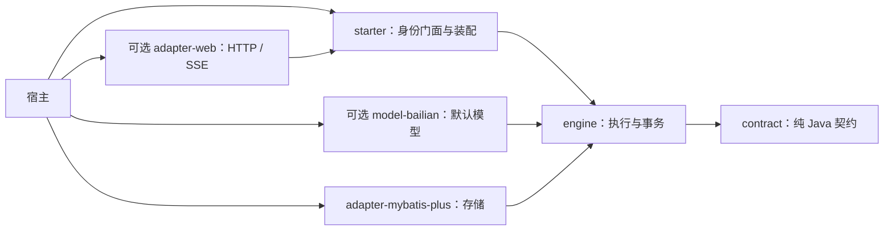

# Spring 重构完成阶段：物理依赖与 2.0 迁移

日期：2026-10-02。实施基线：`59c3bff931efe69ba71a41c0ab379304ec1925d2`。
依据：[整体设计](../superpowers/specs/2026-10-02-spring-framework-design.md)、[本轮实施计划](../superpowers/plans/2026-10-02-spring-physical-split.md)。[第一阶段报告](spring-refactor.md)保留 1.2 当时的兼容与验证结果，本文件描述后续物理拆分。

## 最终依赖结构



`engine` 与 `starter` 不再包含或传递 Spring Web/MVC、Servlet、OkHttp、百炼模型实现。Jackson 仍用于中立结构化响应；Spring Context、事务和自动配置仍属于执行组件的必要依赖。平台宿主适配可以有自己的 HTTP 客户端，不能把核心无 OkHttp 表述成整个仓库无 OkHttp。

只新增一个 `ai-chat-kit-model-bailian` 可选制品，没有新增通用 framework/common、兼容聚合包或插件中心。默认构建 9 个组件 JAR；选择平台宿主后共 10 个组件 JAR。使用方只声明需要的制品，不会因为默认 reactor 构建包含它们而全部获得传递依赖。

## 两种接入方式

所有组件使用同一 `2.0.0-SNAPSHOT` 版本，不能混用 1.2 与 2.0。Java 8 / Spring Boot 2.7、数据库表、配置前缀和 HTTP/SSE 协议保持。

| 需求 | 依赖组合 |
|---|---|
| 无 Web，自定义模型 | starter + adapter-mybatis-plus + 宿主身份/授权适配；提供 AiModelClient Bean |
| 无 Web，百炼模型 | 上述基础组件 + model-bailian |
| 内置 HTTP/SSE | 基础组件 + adapter-web；百炼按需额外声明 model-bailian |
| 自有 Controller | 添加 adapter-web，使用 AiWebStreamResponseFactory 或迁出的旧底层 MVC 门面；可关闭内置路由 |

普通接入仍通过 `@EnableAiChatKit` 与 `ai-chat-kit.ai.engine.enabled=true` 启用。支持的宿主复用已有身份适配；自定义模型只实现模型 SPI，不要求伪造百炼对象。[HTTP 示例](../../examples/ai-engine-host/README.md)和[无 Web 消费者](../../examples/ai-headless-consumer/README.md)分别给出完整 Maven 依赖。

```java
// 无 Web：在真实准备事务提交后，在事务外消费一次。
AiPreparedExecution prepared = singleChatService.prepare(request, expectedActorId);
prepared.consume((event, data) -> eventConsumer.accept(event, data));

// 自有 MVC Controller：responses 是注入的 AiWebStreamResponseFactory。
return responses.stream(singleChatService.prepare(request, expectedActorId));
```

认证与同步准备发生在 Controller 调用时；返回的 MVC 回调只负责消费，不能把认证或准备延后到流线程。`send` 是中立 `prepare` 的同义入口，返回的都是 `AiPreparedExecution`。

## 自动配置及扩展

- 中立策略、状态过期和记忆默认值由 engine 提供；没有供应方依赖也能装配和执行。
- 安装百炼适配且没有自定义 `AiModelClient` 时，模型自动配置先于中立默认配置，保留旧 `readTimeoutSeconds + 30` 和 history 预算。缺省百炼 readTimeout=180，对应占位过期=210 秒；无供应方时中立过期默认=240 秒。
- 自定义模型 Bean 使百炼默认客户端、属性和解析器退让；宿主自定义执行策略和记忆服务同样优先。
- `AiWebExecutionAutoConfiguration` 仅随运行时标记和引擎总开关装配低层门面/编码器。`AiWebAutoConfiguration` 另受 `web.enabled=true` 控制内置路由。仅导入既有 `AiRuntimeActivationConfiguration` 的低层宿主也可使用自有 Controller，无需启用内置路由或 Starter 完整门面。
- 普通 Bean 的 Primary 规则、MCP 严格唯一、必经应用授权、同源真实短事务、提交后消费/取消和客户端资源归属沿用原有语义。
- 结构化群聊响应格式错误现在明确归类为 `GROUP_WORKFLOW_OUTPUT_INVALID` 且不可重试；安全中立异常保留原因分类，不暴露上游正文。

## Java 迁移清单

| 1.2 用法 | 2.0 处理 |
|---|---|
| 只声明 starter 便间接获得百炼和 MVC | 显式选择 model-bailian、adapter-web；核心不再携带它们。 |
| AiHostSingleChatService / AiHostGroupChatService.send 返回 StreamingResponseBody | 改为 AiPreparedExecution；使用 prepare/consume，或 responses.stream 包装。自定义 Controller 需重新编译。 |
| 直接构造两个 Host 门面 | 参数改为 AiSingleChatExecutor / AiGroupChatExecutor。 |
| 三个旧底层 MVC Service、AiChatStreamEventWriter、AiSseEventEncoder | FQCN 保留，但类由 adapter-web JAR 提供，engine JAR 中不再有重复类。此前底层构造器保留。 |
| AiChatStreamEventWriter.write 覆盖 | 保留，收到单独可修改的 Map 副本；中立事件的不可变快照不受污染。 |
| writeBailianEvent(BailianStreamEvent) | 改为 writeModelEvent(AiModelEvent)，避免 Web 依赖具体供应方。 |
| AiConversationMemoryService(BailianProperties) | 使用五整数构造器或注入默认 Bean；百炼预算转交模型自动配置。 |
| 百炼客户端、属性或解析器直接引用 | 类型包名保留，声明 model-bailian 依赖。 |

不承诺旧二进制直接与 2.0 混用。内置 HTTP 客户端沿用现有路径、字段和 SSE 顺序；Java 扩展按上表迁移。

## 验证记录

本轮使用新的隔离候选 Maven 仓库，构建前不含本项目 JAR。先在旧 Starter 的真实运行类路径复现 MVC、OkHttp、Bailian 三类仍存在的失败断言，再在拆分后候选包上验证类缺失。

| 验证对象 | 结果 |
|---|---|
| 组件测试（含可选平台宿主） | 153 项通过 |
| reactor 外 HTTP 消费者 | 20 项通过 |
| reactor 外无 Web 消费者 | 5 项通过 |
| 合计 | **178 项，失败 0、错误 0、跳过 0** |
| 构建与打包 | 13 个组件及父 POM 项目成功；HTTP 示例另行成功打包 |
| 冻结候选制品 | 10 组 thin JAR、sources JAR、独立 POM 和 LICENSE 通过校验；308 个源码/资源条目逐字节匹配，组件间无重复类 |
| 实际 JVM CodeSource | HTTP 消费者加载 8 个、无 Web 消费者加载 4 个本轮候选 JAR，均来自隔离仓库，无 reactor 类目录 |

仅引入 Starter 的真实运行依赖从 27 个 JAR 降至 17 个，其中第三方依赖从 **24 个降至 14 个**；合计 JAR 字节数由 15,844,708 降至 10,012,706（约减少 36.8%）。MVC、OkHttp 与百炼类型在新消费者的真实类路径中缺失，而旧候选上的同一断言失败。完整组件组合的 56 个第三方依赖坐标、scope 与 JAR SHA-256 则保持一致；Web 适配器显式声明 Spring Web/MVC，避免独立 POM 解析发生版本回落。宿主自己的 dependencyManagement 仍可覆盖依赖版本。

[制品与测试清单](spring-physical-split-artifacts.json)记录这次冻结候选的 SHA-256 和数量；它们标识本轮构建，不代表不同时间重新打包会生成相同字节。所有 PostgreSQL 验证仅使用回环地址的一次性随机 schema，测试后已关闭本轮启动的本地数据库；登录、授权和模型为明确受控替身。真实宿主、真实模型和业务服务器不在本轮范围。

复验时先提供本机 `AI_TEST_POSTGRES_URL`，显式使用隔离 settings 与候选 Maven 仓库：

```sh
mvn -B -ntp -Pai-platform-host,ai-engine-example clean install
mvn -B -ntp -f <reactor外HTTP消费者>/pom.xml test
mvn -B -ntp -f <reactor外无Web消费者>/pom.xml test
```

无数据库变量导致跳过的运行不能作为数据库验收。测试副本必须从本轮候选仓库加载组件 JAR，不能把 reactor target/classes 加入类路径。包校验继续检查 thin JAR、sources、独立 POM 与 LICENSE，并新增核心不包含模型/MVC实现的边界检查。

本轮只更新源码与候选制品，不创建公开 Release/tag，不承诺运行时热卸载。启停、依赖升级在重新构建/重启后生效。
