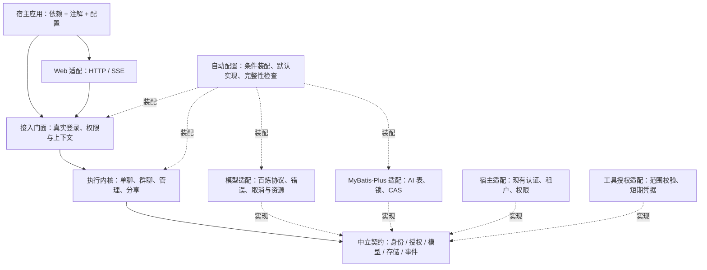
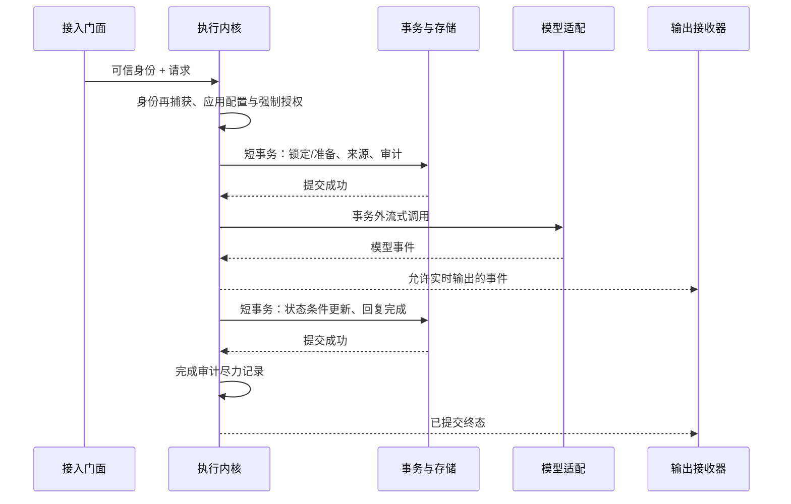

# AI Chat Kit：基于 Spring 思想的整体设计

日期：2026-10-02
代码基线：`717a6d7b9a65f153a68253d6524b7b9ddadfc827`
状态：**架构设计与实施依据，尚未执行本方案的代码重构。**

## 1. 目标与取舍

采用 Spring 的依赖注入、条件自动配置、策略/适配器、模板回调和容器生命周期，把 AI Chat Kit 设计为可嵌入、可替换、默认配置可用的聊天组件。接入方式继续为依赖 + `@EnableAiChatKit` + 配置；已支持宿主的身份适配由组件提供。

基线继续使用 Java 8 / Spring Boot 2.7.18。存储模块保持 `ai-chat-kit-adapter-mybatis-plus`，数据库仍为 PostgreSQL。本次设计不引入响应式框架、通用插件中心、远程配置中心或额外基础设施。启用、关闭与升级仍在重启时生效。

比较三种路线：

| 路线 | 收益与代价 | 选择 |
|---|---|---|
| 只调整注解和类名 | 改动小，但执行器仍绑定具体模型和 HTTP 输出 | 不作为整体方案 |
| 按真实替换边界提取接口，Spring 装配默认实现 | 能逐步消除耦合，并保留接入兼容；每一步可独立验证 | **采用** |
| 通用插件内核、任意责任链、统一抽象基类 | 配置、调试和维护成本高，超出当前需求 | 不采用 |

第一阶段保持现有模块数量与公开入口，通过组合实现内部隔离。物理依赖拆分放到明确的兼容迁移阶段，不能把“类已依赖接口”描述成“JAR 已移除依赖”。

## 2. 当前实现与主要缺口

| 当前事实 | 设计决定 |
|---|---|
| contract 无第三方依赖，已有身份、授权、存储等 Port | 保留中立契约；只为可替换边界补充接口 |
| Starter 已有 marker、总开关、延迟自动配置与最终容器校验 | 沿用；不扩大组件扫描 |
| engine 注入 `BailianClient`、`BailianProperties`，处理供应方事件和异常 | 引入中立模型调用 SPI，将协议细节收进适配器 |
| engine 和 Starter 多个公开方法返回 `StreamingResponseBody` | 先增加中立执行入口，旧方法委托；第一阶段仍保留 MVC 依赖 |
| 单聊业务 Port 同时承担业务快照与工具凭据获取 | 引擎直接完成强制应用授权，业务扩展只补充业务事实 |
| 单聊、群聊重复部分执行步骤与 SSE 编码 | 提取可组合的小型协作类；保留两种模式的状态与输出差异 |
| `AiTransactionExecutor` 已使用 Spring `TransactionTemplate` | 保留同源校验、短事务、提交后回调；移除经验证无用的全局事务代理启用 |
| 存储自有资源与借用资源已有明确关闭责任 | 保留，不将内部 DataSource / 事务管理器 / SqlSessionFactory 注册成宿主候选 |
| `BailianClient.close()` 已回收资源，但新调用登记缺少关闭状态协调 | 补齐停止接收、取消在途、资源释放的并发边界 |
| hosted-proxy 当前实现双身份停止协调 | 保持这一职责；完整远程聊天策略属于后续能力 |

这些结论来自当前源码审查；本方案没有新增运行或测试通过证据。

## 3. 整体结构

下图表示**逻辑职责和调用关系**，不是当前 Maven 依赖树。第一阶段兼容门面仍与引擎处于现有制品中。

| 模块 | 职责与约束 |
|---|---|
| `contract` | 不可变请求/结果、身份和能力接口；不引入 Spring MVC、MyBatis、模型 SDK |
| `engine` | 执行编排、状态推进、事务协调；新内核不引用供应方协议或 SSE |
| `starter` | 显式启用、配置聚合、接入门面和完整性诊断；不承载数据库实现 |
| `adapter-web` | 参数绑定、HTTP 状态、SSE 编码及断连处理；不做持久化状态推进 |
| `adapter-mybatis-plus` | 五张 AI 自有表、行锁、条件更新、资源绑定；不接管宿主 Mapper 扫描 |
| `adapter-mcp-jwt-v1` | 每轮应用/工具授权、凭据签发；身份错误必须拒绝 |
| `mcp-jwt` | JWT 协议与验证能力；不依赖具体宿主 |
| `adapter-hosted-proxy` | 保持现有双身份停止协调；不承担本地模型调用 |
| `host-*` | 复用对应宿主认证、权限及代理；不将宿主框架引入通用契约 |
| 模型适配包 | 第一阶段在现有 engine 内，后续需要移除 SDK 传递依赖时再拆可选制品 |

表中模块名省略共同前缀 `ai-chat-kit-`。不新增通用 framework/common 模块。

## 4. Spring 设计思想如何落地

| 思想 | 具体落点 | 边界 |
|---|---|---|
| IoC / 依赖倒置 | 必需依赖通过构造器注入，默认实现由 `@Bean` 创建 | 业务流程不动态查找 Bean；装配校验可按固定类型查询容器 |
| 策略 | 一个模型调用 SPI、单聊/群聊差异化执行策略 | 有第二种实际实现后再增加配置选择，不先造注册中心 |
| 适配器 | 模型、存储、HTTP、宿主认证分别适配中立契约 | 模型错误码、数据库实体、原始登录 Token 不进入通用结果 |
| 模板与回调 | 固定执行次序，组合状态探针、完成提交等稳定步骤 | 不暴露可跳过认证、租户校验或 CAS 的任意责任链 |
| 工厂与默认实现 | Spring 条件装配提供默认 Bean，用户 Bean 替换普通策略 | 不重复建设静态工厂和单例注册表 |
| 观察者 / 装饰器 | 按需增加完成通知、指标或模型调用观测 | 不作为权限、持久化审计或状态提交的唯一执行路径 |
| 生命周期 | 容器管理拥有的池、客户端与后台任务 | 只关闭组件自建资源；普通 close 足够时不引入 SmartLifecycle |

不要求每个类都增加接口。事件、装饰器、Customizer 仅在有实际消费方时增加；本方案不新增空扩展框架。

## 5. 模型调用 SPI

建议新增 `contract.model` 下的中立模型契约，名称为设计候选，尚不存在：

- `AiModelClient`：应用能力校验、流式执行、按 executionId 取消。
- `AiModelRequest`：配置选择、提示内容、会话续接信息、不可公开的本轮调用凭据。
- `AiModelEvent` / `AiModelResult`：内容增量、终态、会话标识和用量。
- `AiModelFailure`：明确区分取消、会话失效、超时、不可恢复协议失败。

适配器负责供应方应用 ID 规则、HTTP 协议、原生事件/异常转换及连接资源。供应方会话 ID 对内核只是不透明值。供应方提示词和群聊输出协议留在适配包。

凭据只存在于受限的本轮调用对象与适配器内，不进入日志、toString、SSE、持久化事件、用户响应或可序列化通用 DTO；授权判断始终由独立授权 Port 完成。

第一阶段只有默认百炼实现。普通用户通过默认 Bean 即可运行；替换模型的扩展开发者才实现该 SPI。模型调用配置与执行策略配置分离，例如 stale 判定属于执行策略，不能继续直接读取供应方 Properties。

兼容的旧构造器/方法可委托适配器，但不可重新创建第二套 HTTP 连接池。由 Spring 注入的客户端仍由其拥有者关闭。

## 6. 中立输出与执行模板

新增小型事件接收接口与“已准备执行”的句柄：同步入口完成授权与准备。若 REQUIRED 加入宿主外层事务，入口返回并不代表已提交；句柄可以返回，但只能在真实提交后消费，回滚后失效，提前消费明确拒绝。通过事务同步标记就绪与失效，不使用 REQUIRES_NEW 提前提交。流消费保持当前异步执行范围恢复语义。

事件至少能表达当前的开始、内容、成员回复、错误与结束，并保存现有事件顺序与字段。内部事件是一次调用内的类型化回调，不是全局 Spring 事件总线。

过渡期旧 `StreamingResponseBody` 方法委托新入口并连接 SSE 编码器；SSE 写出细节集中一个位置，断连、取消、完成失败的处理沿用现有语义。异步回调必须使用已捕获的可信上下文，并在执行范围结束后清理线程状态。

固定流程如下：

模板保留以下差异：

1. 单聊已输出正文增量后，不重试会话失效；未输出时的一次恢复必须有上限。
2. 群聊先原子完成全部成员回复，再输出成员事件；不能改成逐条提交。
3. 停止与完成通过存储 CAS 决定最终状态，停止事务提交后再取消模型连接。
4. 来源、准备及开始审计保持同一真实事务；终态与会话/成员回复原子提交。完成审计随后尽力记录，失败不得改变已完成状态，不改成新的强制事务参与者。
5. 分享读取继续最终有效期、撤销与归属检查，不依赖缓存事件替代。

先共享少量明确重复的步骤，只有测试证明生命周期一致时才提取协调模板，避免一个大抽象基类。

## 7. 身份、授权与业务扩展

接入门面继续复核真实登录和接口权限；执行内核在可信上下文中执行应用与工具授权。单聊、群聊最终都直接调用 `AiInvocationAuthorizationPort`，由公共授权协作类核对结果与当前应用、身份、工具配置相符。

无工具应用仍检查应用权限；有工具但凭据缺失必须拒绝。群聊当前不支持的工具绑定保持明确拒绝。业务扩展提供业务事实与展示快照，不能通过自定义 Bean 绕过这一授权步骤。

旧 `AiSingleChatBusinessPort.getMcpAuthorization` 暂时保留方法签名，但引擎改为直接调用独立授权 Port。内置宿主保持原接入方式；仅通过旧业务 Port 自定义授权、没有独立授权 Port 的扩展必须迁移。这是扩展装配的行为变化，应提供迁移说明和明确诊断，不能回退使用旧凭据来绕过新授权。迁移测试必须确保每轮只签发一次有效凭据，业务快照不会再次发起授权。

宿主适配继续调用原 Spring 代理，保留权限/租户 AOP。部署提供的包根只用于已支持宿主的适配；请求不能指定类名或切换认证来源。

Hosted 停止协调最终调用 AiConsumedStopPort，当前仓库没有该 Port 的生产实现。其接入方仍需提供同事务的锁定、来源/期限复核、CAS 与审计，以及提交后取消；不能直接调用普通 stop 方法后宣称完成双身份停止协议。

## 8. 自动配置与生命周期

装配层次为：显式激活 → 所选资源与适配器 → 执行服务 → 接入门面 → 可选 Web → 最终完整性诊断。实际配置用明确的 before/after 关系表达，不能依赖 imports 文本顺序；Bean 创建顺序由依赖决定。

- 继续要求启用注解与总开关。未启用时不创建 AI 业务 Bean、数据库池、模型客户端或路由。
- 保持 imports 自动发现和已有兼容注册；配置重排后验证没有重复实例。应用扫描不负责发现组件内部实现。
- 普通替换点使用 `@ConditionalOnMissingBean`，必要时用 `ObjectProvider` 注入可选能力；缺少和候选冲突分别报错。
- 保留各装配边界的既有候选选择规则：Starter 当前的普通单值注入允许 `@Primary` 消歧；MCP 安全装配中使用 `AiMcpV1Beans.unique` 的端口继续严格唯一。不将两者描述为同一规则，也不在本阶段统一收紧。不得用 first、默认实现或 `getIfUnique` 的 null 返回掩盖未解决的候选冲突。
- 校验最终容器的完整能力组合；选中的模式缺存储、事务、身份或授权时启动失败，错误只包含安全的类型/配置键信息。
- 避免自动配置启用无必要的宿主级设施。四处 `@EnableTransactionManagement` 在确认无注解事务消费者后删除，保留现有事务模板。
- 客户端通过同一同步状态协调关闭和调用登记：关闭开始后拒绝新调用；已登记调用被取消；清理幂等。若确有异步停机等待需求，再采用有界 SmartLifecycle。
- MyBatis 会话工厂继续仅属于 AI 资源持有者，支持 reuse/reference/isolated 的现有资源归属规则；跨源事务不能静默降级。

## 9. 兼容迁移与轻量边界

第一阶段保持模块坐标、配置键、HTTP/SSE 字段与既有发送方法签名，内置宿主保持原接入方式。自定义旧授权扩展需要迁到独立授权 Port；直接构造执行器的高级使用方也需按新增依赖迁移，不能承诺所有旧构造器行为零改动。新接口使内部编排可以独立于供应方和传输测试，但 `engine` 的物理依赖仍可能含 MVC、OkHttp，文档和依赖报告必须如实列出。

彻底移除依赖不能与保留原制品中 MVC 类型签名同时完成。后续采用显式版本迁移：新 engine 保留中立 API，HTTP 方法进入 Web 接入边界，Starter 门面改为中立结果；旧调用方按迁移表更新或选择兼容制品。不要制造 `starter → adapter-web → starter` 环。

若用户要求旧 Maven 消费方式零改动，应推迟物理移除，而不是标 optional 后宣称兼容。若确有第二种模型或 SDK 体积收益，可新增一个可选百炼适配制品；该变化独立评估 BOM、Starter 默认依赖和发布清单。

框架设计不承诺任意宿主零适配；内置支持的宿主保持无手写 AI 适配代码。用户只实现其确需替换的能力，不要求逐个补齐所有 Port。

## 10. 验收标准

| 领域 | 必须证明的结果 |
|---|---|
| 激活与装配 | 未启用无副作用；选定模式缺依赖清晰失败；普通 Bean 可替换；Starter 的 Primary 消歧和 MCP 严格唯一分别验证 |
| 模型替换 | 使用受控假模型跑完整流程，无需 BailianClient；默认百炼事件转换保持兼容 |
| 授权 | 自定义业务扩展不能跳过应用权限；每轮授权一致；错误身份/租户/工具范围被拒绝 |
| 事务 | 同源资源绑定、短事务、准备/来源/开始审计原子性、完成/停止 CAS、取消在提交之后；外层提交前不可消费、回滚句柄失效；完成审计失败不改终态 |
| 输出 | SSE 字段与顺序不变；单聊恢复限制、群聊完成后输出、断连清理 |
| 生命周期 | 关闭与调用登记交错时无漏取消；重复关闭安全；借用宿主资源不被关闭 |
| 存储 | MyBatis-Plus 独立会话工厂；真实本地 PostgreSQL 回归覆盖锁与事务语义 |
| 兼容 | 内置宿主及旧发送方法消费者编译运行；旧自定义授权扩展有明确迁移用例；新入口可无 HTTP 输出；独立消费者使用候选 JAR 而非 reactor 类目录 |
| 体积 | 第一阶段无新增框架依赖、无新增 Maven 模块；物理依赖移除需单独证明 |

本轮只交付设计与实施计划。现有历史测试记录保留其原始范围，不作为新设计已实现的证据；真实宿主联调、部署和发布另行计入。

## 11. 源码与官方依据

源码入口（均为上述基线）：

- [Starter 激活与装配](../../../ai-chat-kit-components/ai-chat-kit-starter/src/main/java/io/github/yoyocw/aichatkit/ai/starter/autoconfigure/AiStarterAutoConfiguration.java)
- [单聊执行器](../../../ai-chat-kit-components/ai-chat-kit-engine/src/main/java/io/github/yoyocw/aichatkit/module/ai/service/chat/AiChatExecutionService.java)
- [群聊流执行器](../../../ai-chat-kit-components/ai-chat-kit-engine/src/main/java/io/github/yoyocw/aichatkit/module/ai/service/groupchat/AiGroupChatStreamService.java)
- [真实事务模板](../../../ai-chat-kit-components/ai-chat-kit-engine/src/main/java/io/github/yoyocw/aichatkit/ai/engine/transaction/AiTransactionExecutor.java)
- [存储资源所有权](../../../ai-chat-kit-components/ai-chat-kit-adapter-mybatis-plus/src/main/java/io/github/yoyocw/aichatkit/ai/adapter/jdbc/config/AiJdbcResources.java)
- [模型客户端生命周期](../../../ai-chat-kit-components/ai-chat-kit-engine/src/main/java/io/github/yoyocw/aichatkit/module/ai/framework/bailian/BailianClient.java)
- [分阶段实施计划](../plans/2026-10-02-spring-framework-design.md)

Spring 官方依据：Boot 2.7 支持条件自动配置与用户 Bean 覆盖，自动配置发现应独立于包扫描，简单 Starter 无需强制拆为两个模块。见 [Boot 2.7.18 自动配置](https://docs.spring.io/spring-boot/docs/2.7.18/reference/html/features.html#features.developing-auto-configuration)。`getIfUnique` 对缺失与非唯一都可能返回 null，见 [ObjectProvider 5.3.39](https://docs.spring.io/spring-framework/docs/5.3.39/javadoc-api/org/springframework/beans/factory/ObjectProvider.html)。SmartLifecycle 适用于需要启动/关闭阶段和异步停止回调的组件，见 [生命周期 API](https://docs.spring.io/spring-framework/docs/5.3.39/javadoc-api/org/springframework/context/SmartLifecycle.html)。
